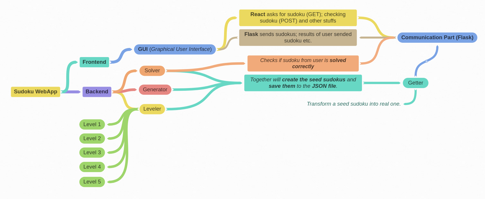

# Sudoku
[Check out the development process on Trello!](https://trello.com/b/PfZc7t8b)

## How to run
* Run `npm install` before trying to run live react server just to check (update, install) dependencies.
* `npm run` will run the react (frontend) server.
* `yarn start-api` will run the backend server (see more in `package.json`).
  * Or just `cd api` and `python app.py`. 

**If you are having troubles to run the live server** with `npm run` and you are getting errors, try delete the `node_modules` directory (`sudo rm -r node_modules`) and run `npm install` to install all the packages again. 

## App
